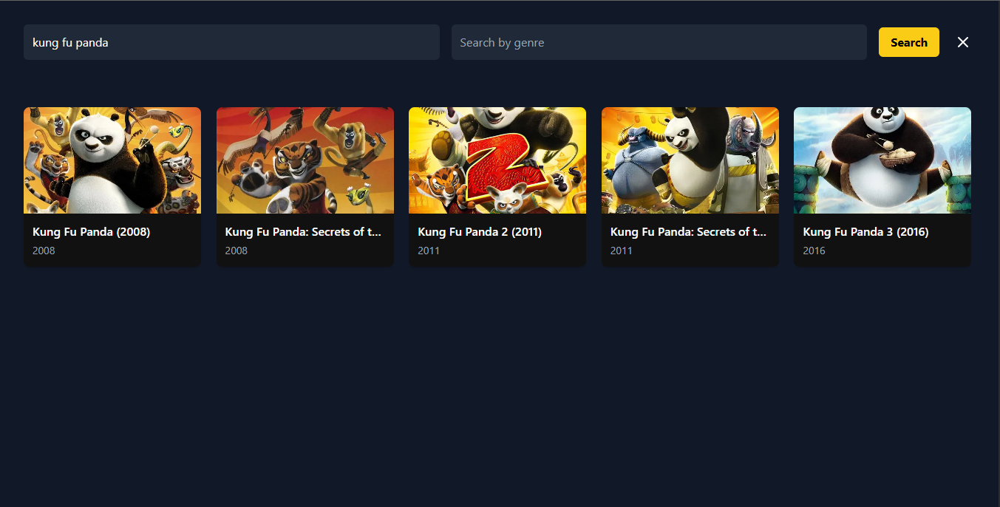
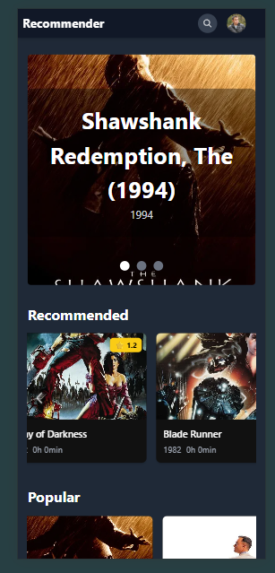

# 🎬 Movie Recommendation System

A **full-stack Movie Recommendation System with Data Science integration**. The backend not only serves the UI but also implements **hybrid recommendation models** combining **Collaborative Filtering** and **Content-Based Filtering** to provide **personalized and improved movie recommendations**. The frontend is built with **React + Tailwind CSS** and displays movie recommendations in an elegant UI.


---

## 🛠 Tech Stack

* **Backend:** FastAPI, Pandas, Scikit-learn, Python  
* **Frontend:** React, Tailwind CSS, Axios, Framer Motion  
* **Data:** CSV (`movies.csv`, `ratings.csv`)  
* **APIs:** TMDB API for movie posters

---

## 📊 Recommendation Models Used

1. **Collaborative Filtering**

   * User-based similarity
   * Cosine similarity on user-movie ratings

2. **Content-Based Filtering**

   * TF-IDF vectorization of movie genres
   * Cosine similarity between movie genre vectors

3. **Hybrid Recommendation**

   * Weighted combination of content-based and collaborative scores

---

## 📂 Project Structure

PROJ\
├── backend\
│   ├── data\
│   │   ├── movies.csv\
│   │   └── ratings.csv\
│   ├── src\
│   │   ├── collaborative.py\
│   │   ├── contentBased.py\
│   │   ├── hybrid.py\
│   │   └── utils.py\
│   ├── app.py\
│   ├── requirements.txt\
│   └── readme.md\
├── frontend\
│   ├── public\
│   ├── src\
│   │   ├── assets\
│   │   ├── components\
│   │   ├── services\
│   │   ├── App.jsx\
│   │   ├── App.css\
│   │   └── main.jsx\
│   ├── package.json\
│   └── vite.config.js\
└── README.md


---

## ⚡ Features

* **Hybrid Recommendation**: Combines collaborative filtering & content-based filtering  
* **Popular Movies**: Shows globally popular movies  
* **Search**: Search by movie name and/or genre  
* **Genre Filtering**: Filter movies by genre  
* **Responsive UI**: Movie carousel, horizontal lists, and modal search  
* **Dynamic TMDB Posters**: Fetch posters using TMDB API

---

## 🔗 API Endpoints

| Endpoint          | Method | Description                    |
| ----------------- | ------ | ------------------------------ |
| `/recommend`      | GET    | Hybrid movie recommendations   |
| `/popular-movies` | GET    | Get top popular movies         |
| `/search`         | GET    | Search movies by name or genre |
| `/genre-movies`   | GET    | Filter movies by genre         |

**Example: Hybrid Recommendation**

```bash
GET http://127.0.0.1:8000/recommend?user_id=1&movie_title=Aliens&alpha=0.6&top_n=5
````

**Response:**

```json
{
  "user_id": 1,
  "movie_title": "Aliens",
  "recommendations": [
    {"rank": 1, "title": "Alien 3", "score": 0.89},
    {"rank": 2, "title": "Predator", "score": 0.85}
  ]
}
```

---

## 🚀 Installation

### Backend

```bash
cd backend
python -m venv venv
source venv/bin/activate  # Windows: venv\Scripts\activate
pip install -r requirements.txt
uvicorn app:app --reload
```

### Frontend

```bash
cd frontend
npm install
npm run dev
```

Open the frontend at `http://localhost:5173` and backend at `http://127.0.0.1:8000`.

---

## 🎯 Usage

* Browse **top popular** and **recommended movies**
* Click **search icon** → open modal → search by name or genre
* Explore movies with **poster, score, release year, and rating**

---

##  Frontend Showcase

## Over All view

*overll view of the application*

### Movie Carousel


*Smooth horizontal scroll with featured movies.*

### Search Modal


*Search movies by name or genre with live filtering.*

### Responsive Design

\
*UI adapts seamlessly across mobile, tablet, and desktop.*

**Tailwind Highlights:**

* Clean, modern layout
* Hover animations on movie cards
* Smooth modal transitions using Framer Motion
* Horizontal scroll for popular and recommended lists

---

## 💡 Future Improvements

* Add **movie runtime** and additional metadata
* Implement **user authentication** and personalized watchlist
* Improve **UI animations** for smoother experience
* Add **pagination** for search results

